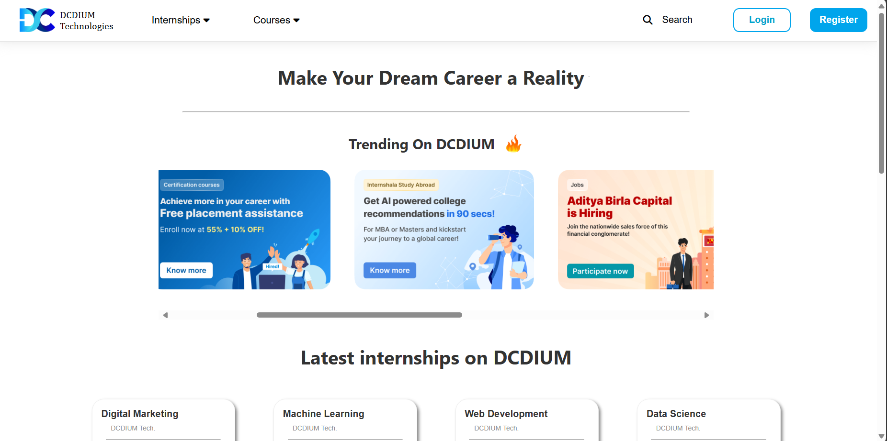

# Internship Recruitment Portal

## Overview
This web application is a recruitment portal designed to streamline the hiring process. It was developed during my internship at DCDIUM Technologies as a platform for job seekers to discover opportunities and recruiters to find suitable candidates.

## Features
* **User Authentication:** Secure user registration and login for both job seekers and recruiters.
* **Job Posting:** Intuitive interface for recruiters to create and manage job listings.
* **Job Search:** Advanced search functionality for job seekers to filter and find relevant positions.
* **Application Management:** Efficiently track and manage job applications for recruiters.
* **Candidate Profiles:** Customizable profiles for job seekers to showcase their skills and experience.

## Technologies Used
* **HTML:** Structure the web pages.
* **CSS:** Style the user interface.
* **JavaScript:** Enhance user interactions and dynamic content.

## Installation
To run this project locally:
1. Clone the repository: `git clone https://github.com/your-username/internship-recruitment-portal.git`
2. Open the project in a code editor.
3. Open `index.html` in a web browser.

## Usage
* **Job Seekers:** Create an account, search for jobs, apply for desired positions, and manage job applications.
* **Recruiters:** Create an account, post job openings, review applications, and manage the hiring process.

## Screenshot

## Challenges and Solutions
* **Challenge:** Implementing a robust search algorithm for job listings.
* **Solution:** Used a combination of JavaScript and regular expressions to create efficient search functionality.

## Learnings
* Gained hands-on experience in web development using HTML, CSS, and JavaScript.
* Improved problem-solving and debugging skills.
* Learned about user interface design and user experience principles.

## Future Improvements
* Integrate a messaging system for communication between job seekers and recruiters.
* Implement a rating system for job seekers and recruiters.
* Add mobile responsiveness for better user experience on different devices.

## Contact
- Feel free to contact
- Happy Learning..!
